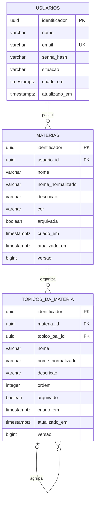

# Diagrama ER do catalogo pessoal

Este recorte descreve as tabelas implementadas ate a Sprint 3. O usuario e
obtido exclusivamente pela sessao autenticada; os identificadores de usuario
nao fazem parte dos contratos publicos de materias e topicos.

Restricoes relevantes:

- materia tem nome normalizado unico por usuario;
- topico tem nome normalizado unico entre irmaos, inclusive no nivel raiz;
- topico-pai pertence a mesma materia por regra do caso de uso;
- ciclos sao rejeitados antes da persistencia;
- materias com topicos e topicos com filhos nao sao excluidos fisicamente.
