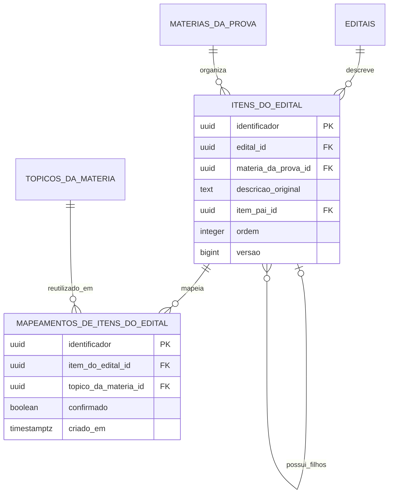

# Conteudo programatico e mapeamentos

Este recorte corresponde a Sprint 5. ItemDoEdital preserva o texto oficial no
contexto de um edital e de uma materia da prova. MapeamentoDeItemDoEdital liga
esse texto a um topico pessoal sem copiar ou assumir a propriedade do topico.

Regras de integridade:

- a descricao oficial e obrigatoria e armazenada sem normalizacao;
- o item-pai pertence a mesma materia da prova e ao mesmo edital;
- um item nao pode ser pai de si nem ser movido para um descendente;
- edital e materia da prova pertencem ao mesmo concurso;
- o topico mapeado pertence a mesma Materia reutilizada por MateriaDaProva;
- o par item e topico e unico, e todo mapeamento manual nasce confirmado;
- remover o mapeamento nao remove ItemDoEdital nem TopicoDaMateria;
- todas as consultas chegam ao usuario autenticado pela hierarquia;
- concursos arquivados continuam consultaveis, mas seus itens e mapeamentos nao
  podem ser alterados.
