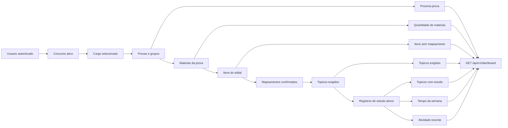

# Dashboard objetivo

O dashboard da Sprint 7 e uma consulta derivada. Nao existe tabela nem entidade
`Progresso`: cada numero e recalculado a partir do concurso ativo, do cargo
selecionado, dos mapeamentos confirmados e dos registros de estudo ativos.

Regras da consulta:

- o usuario autenticado define o concurso consultado;
- somente o cargo selecionado alimenta as medidas de conteudo;
- topicos exigidos sao os topicos de mapeamentos confirmados;
- um topico possui estudo quando existe ao menos um registro `ATIVO`;
- o tempo semanal soma registros ativos de segunda-feira ate o inicio da
  segunda-feira seguinte, no fuso `America/Sao_Paulo`;
- consultas usam `EXISTS` para que um mesmo estudo nao seja duplicado quando o
  topico aparece em varios itens;
- atividade recente mostra no maximo seis estudos ativos da trilha;
- alertas seguem ordem e regras deterministicas;
- a barra visual representa cobertura de topicos com registro, nunca dominio
  ou conhecimento estimado.
