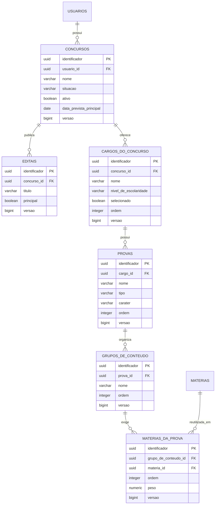

# Diagrama ER da estrutura de concursos

Este recorte corresponde a Sprint 4. Todas as consultas percorrem a hierarquia
ate o concurso e aplicam o identificador do usuario obtido da sessao.

Restricoes relevantes:

- somente um concurso ativo por usuario;
- somente um edital principal por concurso;
- somente um cargo selecionado por concurso;
- cargo, prova e grupo rejeitam nomes duplicados no respectivo pai;
- a mesma materia nao se repete no grupo, mas pode ser reutilizada em outros
  grupos e concursos sem copia;
- todas as entidades usam versao para detectar atualizacoes concorrentes;
- a hierarquia usa chaves estrangeiras sem exclusao em cascata;
- um concurso arquivado permanece consultavel, mas nao aceita mudancas de
  conteudo.
