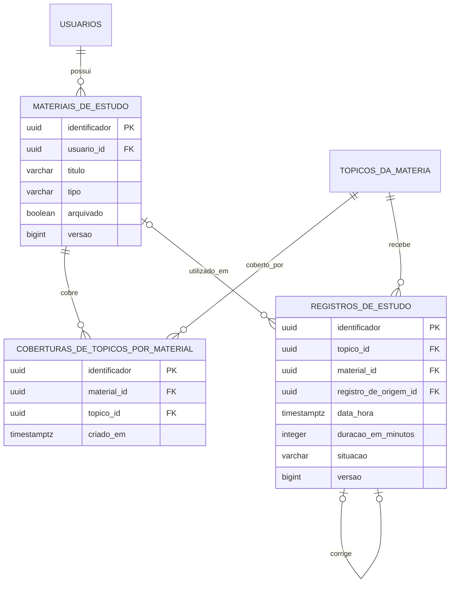

# Materiais e registros de estudo

Este recorte corresponde a Sprint 6. O estudo pertence ao topico pessoal, nao
ao concurso. Assim, um unico registro e reutilizado quando o mesmo topico esta
mapeado em itens de concursos diferentes.

Regras de integridade:

- material, topico e registro sao acessados somente pelo usuario autenticado;
- o par material e topico e unico;
- um material opcional deve cobrir o topico informado no estudo;
- a duracao aceita valores entre 1 e 1.440 minutos;
- somente enderecos HTTP ou HTTPS sao aceitos;
- material arquivado permanece no historico e bloqueia alteracoes;
- corrigir marca o original como `CORRIGIDO` e cria um novo registro `ATIVO`;
- cancelar marca o registro como `CANCELADO`;
- registros de estudo nunca sao excluidos fisicamente;
- remover uma cobertura preserva material, topico e registros anteriores.
