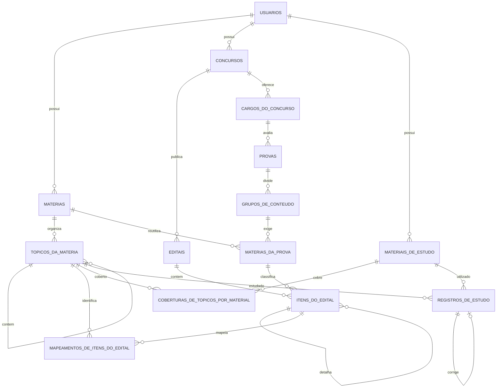

# Modelo ER consolidado

O diagrama representa persistencia e vinculos. Progresso e dashboard nao sao
tabelas: ambos sao calculados a partir dos fatos existentes.

As chaves parciais do PostgreSQL asseguram no maximo um concurso ativo por
usuario, um edital principal por concurso e um cargo selecionado por concurso.
As demais invariantes de compatibilidade e pertencimento sao verificadas pelos
casos de uso antes da persistencia.
